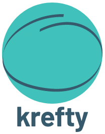

---

[](https://github.com/ustits/krefty/actions/workflows/build.yml)
[](https://github.com/ustits/krefty/blob/main/LICENSE)
[](https://maven-badges.herokuapp.com/maven-central/dev.ustits.krefty/krefty-core)

Krefty is a tool for constructing concrete (refined) types specific for your domain. It uses refinement type theory,
i.e. types wrapping a predicate and a value which satisfies it. 
For DDD users refined types can be viewed as an alternative to value objects or [whole objects](http://c2.com/ppr/checks.html#1). 
Inspired by implementations in [haskell](https://github.com/nikita-volkov/refined)
and [scala](https://github.com/fthomas/refined).

Also check out [arrow-exact](https://github.com/arrow-kt/arrow-exact) and [values4k](https://github.com/fork-handles/forkhandles/tree/trunk/values4k) which solve the same problem. 

## Getting started

```
implementation("dev.ustits.krefty:krefty-core:<latest_version>")
```

## Usage

Use `refine` and pass a desired predicate. It will return a `Refined` type which holds a value if it 
matches a predicate or an exception if not:

```kotlin
val name = "Krefty" refine NotBlank()
name.getOrThrow() // "Krefty"

val version = "" refine NotBlank()
version.getOrThrow() // RefinementException
```

`Refined` type can be used to construct new types, for example, 
by passing it in the constructor:

```kotlin
class NotBlankString private constructor(private val value: String) {
    constructor(refined: Refined<NotBlank, String>) : this(refined.getOrThrow())
}

val notBlank = NotBlankString(refined)
```

### Predicates

Krefty is shipped with predefined `Predicate`s but it strongly encouraged to make domain specific ones. 
New predicates can be made by implementing `Predicate` or by using delegation:

```kotlin
class UserID : Predicate<Int> {
}
// or
class UserID : Predicate<Int> by Positive()

val userID = 443812 refine UserID()
```

Combine predicates using `and`, `or` functions or by `All` and `Some` classes:

```kotlin
class Percent : Predicate<Int> by GreaterOrEqual(0) and LessOrEqual(100)
// or
class Percent : Predicate<Int> by All(GreaterOrEqual(0), LessOrEqual(100))

val percent = 45 refine Percent()
```

Invert predicates with `!` function or `Not` class:

```kotlin
class NotPercent : Predicate<Int> by !Percent()
// or
class NotPercent : Predicate<Int> by Not(Percent())
```
